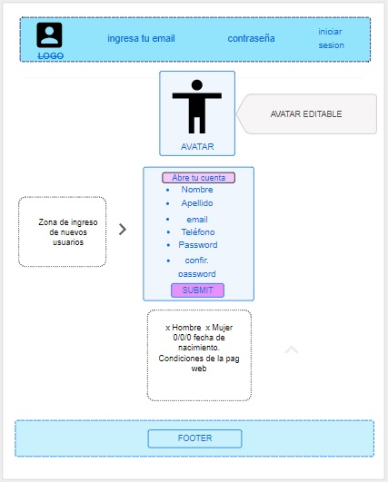
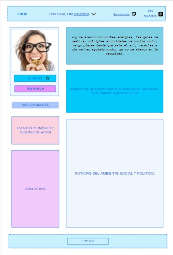
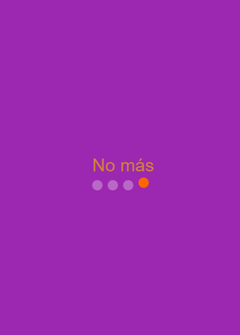
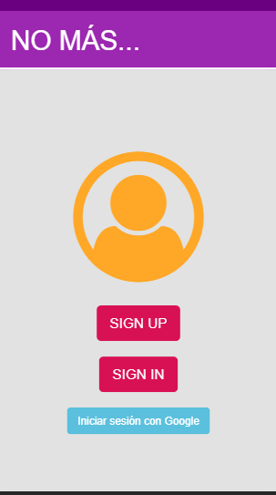
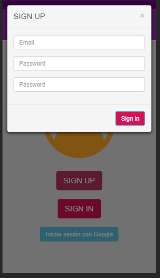
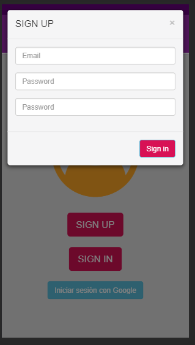
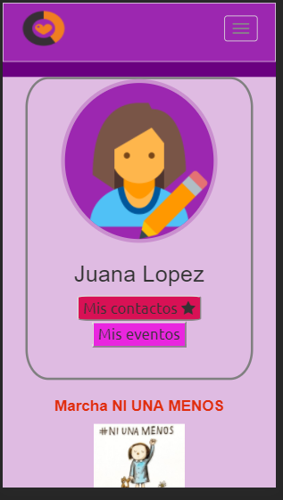

# PRODUCTO FINAL SPRINT 3 :

## ESPECIFICACIONES DE RETO :

## Lenguajes utilizados :

~~~
HTML
~~~
~~~
CSS
~~~
~~~
JAVASCRIPT
~~~    
***
## Fuentes de información necesarias para resolver el ejercicio:
 * https://oscarotero.com/jquery/
 * https://www.usability.gov/what-and-why/visual-design.html
 * http://www.elcomercio.com/afull/colores-violenciadegenero-mujeres-lucha-simbolos.html

 ## Flujo de la Aplicacion :

 La aplicacion comienza con una vista splash , luego se direcciona a una vista principal en donde el usuario tiene la posibilidad de crearse una cuenta ; debido a la temática de la red social ,es necesario incluir una seccion en donde se deje en claro que esta red social no fué diseñada para juzgar a las victimas ni para generar cualquier tipo de agresion ,  las usuarias tienes la posibilidad de ser orientadoras , que son personas dispuestas a ayudar a las victimas en lo que se neesite (ayuda psicologica , judicial , médica , entre otros) , o tambien espectadoras(debido a que no quisimos hacer algun tipo de discriminacion es que las espectadoras no neccesariamente son victimas )y las usuarias tambien tienen la posibilidad de registrarse con su nombre o con un pseudónimo(porque somos concientes de que las personas que han experimentado algun tipo de violencia pueden querer no revelar su identidad por el momento (porque aun no se sienten listas o por otras razones )).

***PROYECTO: RED SOCIAL***
***NOMBRE: NO MAS***

TEMATICA: SOCIAL
1. Público objetivo :Dirigido a todas las mujeres, que han sido víctimas de algun tipo de agresión física y/o emocional y a las que desean informarse sobre el tema.
2. Problemática: Debido a la falta de apoyo profesional cercano y de manera más certera, nos vemos con la necesidad de la creación de una red social, en la cual se pueda  brindar apoyo tanto profesional y no profesional, orientado  a todas aquellas personas que este pasando por ese momento crítico que implica usar la violencia. Ninguna mujer ni personas alguna, debe para por una situacion parecida, y de pasarlo, no debe sentir sola.
Nuestra red social, contará con el apoyo de profesionales tales como: psicólogos, abogados, comunicadores sociales, etc,  orientando de manera profesional y/o emocional en el proceso de sanación post- agresión.

## Fase de diseño :
 Algo que nos tomó algo de tiempo fué la pagina de diseño ,debido a que los colores que estabamos pensando para el proyecto no parecían algo fácil de combinar , afortunadamente decidimos jugar con tonalidades fuertes y bajas de estos matices ; para ello utilizamos una herramienta de diseño que hizo que este proceso sea mucho más fácil , además de que nos ayudo a tener un app mejor estructurada ; a continuación citamos la página :
*  https://material.io/color/#!/?view.left=0&view.right=0

Esta página nos ayudo mucho con el tema porque nuestros primeros mockups no eran tan estructurales ;
a continuacion mostramos los mockups:

## Eleccion de colores de la página :

Eleccion de colores para la página :
Debido a la temática de la red social decidimos incluir colores que siempre hayan estado vinculados al tema , dichos colores son :
El morado , el naranja y el fucsia , cada uno tiene una historia detrás de la elección:
¿Por qué naranja? ¿Por qué morado? ¿Qué otros colores se asocian a esta lucha? Para esta última pregunta no hay una respuesta clara. En todo el mundo existen organizaciones que se apropian de uno -o varios- colores para simbolizar su lucha contra esta problemática social que, según cifras de la Organización Mundial de la Salud (OMS), afecta al 35% de las mujeres. Ahora bien, dónde salió cada uno de estos colores. Únete se apropió del naranja para la lucha de este año. Esto porque este color simboliza en varias culturas el final de un ciclo y el inicio de uno nuevo. Entonces, el naranja invita a los ciudadanos a ser parte de un nuevo ciclo, uno sin violencia contra la mujer. Pero la historia del morado va más atrás y tendremos que volver varios años en el tiempo y quizás recordarte algo que puedes haber aprendido en la clase de historia. Ahora estamos en el 25 de marzo de 1911 en Nueva York (EE.UU.) cuando ocurrió una tragedia en una fábrica textil de esa ciudad estadounidense grabada en los libros de historia como el incendio en la fábrica Triangle Shirtwaist y le costó la vida a 146 personas, la mayoría de ellas mujeres. Es más conocido que de ese día se desprende la celebración del Día Internacional de la Mujer (que anualmente se conmemora cada 8 de marzo). Sin embargo, de ahí también sale un color que representa la lucha de los colectivos femeninos: el morado, así lo explica Cristina Burneo docente de la Universidad Andina Simón Bolívar especializada en letras, traducción y género. Según Burneo, el morado se adoptó como un símbolo de lucha contra la violencia hacia las mujeres por ese incidente. “Es un color simbólico que no necesariamente tiene que ver con el 25 de noviembre ni con el 8 de marzo”, asegura. Y al regresar a la pregunta inicial ¿por qué el morado? Porque el día del incendio se estaban fabricando telas de ese color. Y aunque este es un hecho poco preciso, históricamente hablando, se ha convertido en algo simbólico, según Burneo.

NECESIDADES A ENFOCAR:

* A que nos referimos con agresión física y/o emocional.
* Delimitar los conceptos de agresión física y emocional.
* Dar a conocer tratamiento y terapias de recuperación post-agresión.
* Asesoramiento legal para poder tramitar de manera correctas las denuncias contra agresiones.
* Apoyo moral de parte de las otras víctimas, al contar sus experiencias y situaciones a las personas que están siendo víctimas de agresión.
* Coordinación de terapias grupales.
* Noticias de los últimos casos en proceso a una respuesta justa de parte de las autoridades.
* Noticias de personajes que toman la iniciativa para denunciar de manera pública situaciones de agresión.

***VISTA DE INICIO***

***VISTA REGISTRARSE***

***VISTA INICIAR SESION***

***VISTA PERFIL***

***VISTA MI PAGINA PRINCIPAL**

##Agradecimientos Especiales :

Queremos agradecer a Mariana Guerra (Psicóloga de Laboratoria y Jedi Master) por brindarnos orientación en el tema ;lo cual era algo sumamente importante para poder llegar al producto final. Muchas gracias Mariana :)
